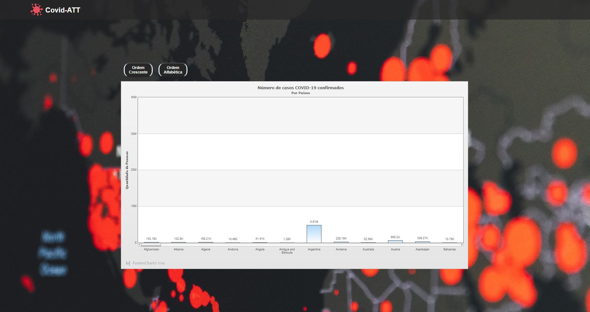

<h1 align="center">
    
</h1>

<h4 align="center">
  ☕ Desafio VueJS
</h4>

## 📷 Pages

<h1 align="center">
    
</h1>

<br>

## :rocket: Tecnologias

Esse projeto foi desenvolvido com as seguintes tecnologias:

- [VueJS](https://vuejs.org)

## 💻 Projeto

O projeto relata a quantidade de contaminados por Covid-19, por paises, da qual foi alimentado por dados de uma api pública.

## Project setup
```
yarn install
```

### Compiles and hot-reloads for development
```
yarn serve
```

### Compiles and minifies for production
```
yarn build
```

### Lints and fixes files
```
yarn lint
```

### Customize configuration
See [Configuration Reference](https://cli.vuejs.org/config/).
